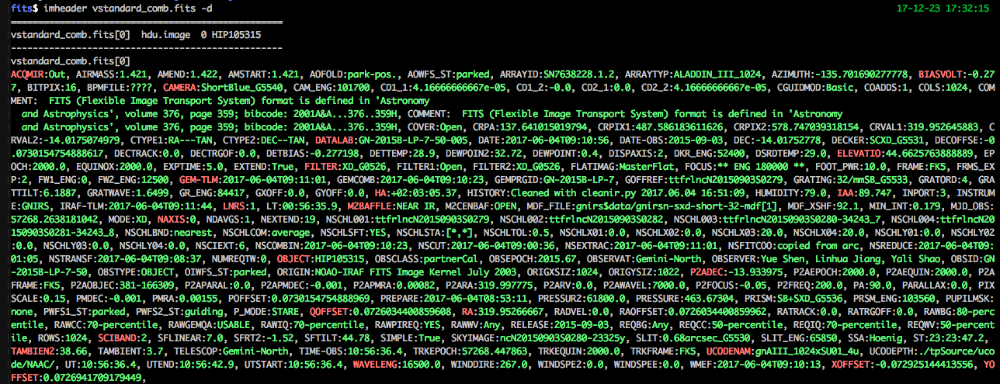

imheader
========
A command line tool to check the headers or do filtering for fits file using header information.

demos
-----
In these demos, command after \$ is the bash input, the remaining is the output. we use the (...) to omit some long outputs.

You can generate the demo result and test imheader by yourself::

    cd demo/fits
    bash imheader.doc.sh

with no options: output the full header of extension 0 for this file::

   $ imheader N20150903S0254.fits
   ==================================================
   N20150903S0254.fits[0]  hdu.image  0 GCALflat
   --------------------------------------------------
   N20150903S0254.fits[0]
   SIMPLE  =                    T / file does conform to FITS standard
   BITPIX  =                   16 / number of bits per data pixel
   NAXIS   =                    0 / number of data axes
   EXTEND  =                    T / FITS dataset may contain extensions
   (...)

work for file list:output the full header of extension 0 for every file in a file list::

    $ cat test_list.txt
    N20150903S0254.fits
    N20150903S0255.fits
    $ imheader test_list.txt
    ==================================================
    N20150903S0254.fits[0]  hdu.image  0 GCALflat
    --------------------------------------------------
    N20150903S0254.fits[0]
    SIMPLE  =                    T / file does conform to FITS standard
    BITPIX  =                   16 / number of bits per data pixel
    NAXIS   =                    0 / number of data axes
    EXTEND  =                    T / FITS dataset may contain extensions
    (...)
    ==================================================
    N20150903S0255.fits[0]  hdu.image  0 GCALflat
    --------------------------------------------------
    N20150903S0255.fits[0]
    SIMPLE  =                    T / file does conform to FITS standard
    BITPIX  =                   16 / number of bits per data pixel
    NAXIS   =                    0 / number of data axes
    EXTEND  =                    T / FITS dataset may contain extensions
    (...)
    $ imheader N20150903S*
    (... same output result as the above command)

Overview fits struct using ``--show``: the output columns are:

* filename[extension number]
* extension type: image or table
* extension name (EXTNAME)
* deminsion of data: 0(no data), 1(1d data) or 2(2d image)
* data size
* object name (OBJECT)::

    $ imheader N20150903* vstandard_comb.fits --show
    N20150903S0254.fits[0] hdu.image  0 GCALflat
    N20150903S0254.fits[1] hdu.image  2 [1024, 1022]
    N20150903S0255.fits[0] hdu.image  0 GCALflat
    N20150903S0255.fits[1] hdu.image  2 [1024, 1022]
    vstandard_comb.fits[0] hdu.image  0 HIP105315
    vstandard_comb.fits[1] hdu.image SCI 1 [1022] HIP105315
    vstandard_comb.fits[2] hdu.image VAR 1 [1022] Combine sigma images for tmpcombout34243_78
    vstandard_comb.fits[3] hdu.image DQ 1 [1022] HIP105315
    vstandard_comb.fits[4] hdu.image SCI 1 [1022] HIP105315
    vstandard_comb.fits[5] hdu.image VAR 1 [1022] Combine sigma images for tmpcombout34243_85
    vstandard_comb.fits[6] hdu.image DQ 1 [1022] HIP105315
    vstandard_comb.fits[7] hdu.image SCI 1 [1022] HIP105315
    vstandard_comb.fits[8] hdu.image VAR 1 [1022] Combine sigma images for tmpcombout34243_89
    vstandard_comb.fits[9] hdu.image DQ 1 [1022] HIP105315
    vstandard_comb.fits[10] hdu.image SCI 1 [1022] HIP105315
    vstandard_comb.fits[11] hdu.image VAR 1 [1022] Combine sigma images for tmpcombout34243_93
    vstandard_comb.fits[12] hdu.image DQ 1 [1022] HIP105315
    vstandard_comb.fits[13] hdu.image SCI 1 [1022] HIP105315
    vstandard_comb.fits[14] hdu.image VAR 1 [1022] Combine sigma images for tmpcombout34243_97
    vstandard_comb.fits[15] hdu.image DQ 1 [1022] HIP105315
    vstandard_comb.fits[16] hdu.image SCI 1 [1022] HIP105315
    vstandard_comb.fits[17] hdu.image VAR 1 [1022] Combine sigma images for tmpcombout34243_101

select key names to print using ``-k``::

  $ imheader N20150903*.fits -k"object,date,exptime"
  ==================================================
  N20150903S0254.fits[0]  hdu.image  0 GCALflat
  --------------------------------------------------
  N20150903S0254.fits[0]
  OBJECT  = 'GCALflat'           / Object Name
  DATE    = '2015-09-03'         / Date
  EXPTIME =                  1.2 / integration time (seconds)
  ==================================================
  N20150903S0255.fits[0]  hdu.image  0 GCALflat
  --------------------------------------------------
  N20150903S0255.fits[0]
  OBJECT  = 'GCALflat'           / Object Name
  DATE    = '2015-09-03'         / Date
  EXPTIME =                  1.2 / integration time (seconds)

print keys in 'short' mode (the prints above are called 'long' mode) using ``-s``, you use use ``-k`` at the same time to select keys for printing. If some key not exists in some extensions, they are markd as '-'::

  $ imheader *.fits -k"object,date,exptime" -s
  FileName                        OBJECT                DATE EXPTIME
  N20150903S0254.fits[0]        GCALflat          2015-09-03     1.2
  N20150903S0255.fits[0]        GCALflat          2015-09-03     1.2
  N20150904S0254.fits[0]         HIP7202          2015-09-04     3.0
  N20150905S0124.fits[0]       HIP105315          2015-09-05     3.0
  N20150906S0078.fits[0]       HIP105315          2015-09-06     3.0
  N20150907S0030.fits[0]       HIP115119          2015-09-07     0.2
          bbody1.fits[0]               - 2017-06-04T09:15:28       -
          bbody2.fits[0]               - 2017-06-04T09:15:28       -
          bbody3.fits[0]               - 2017-06-04T09:15:29       -
          bbody4.fits[0]               - 2017-06-04T09:15:29       -
          bbody5.fits[0]               - 2017-06-04T09:15:30       -
          bbody6.fits[0]               - 2017-06-04T09:15:30       -
      m2fs_flat0.fits[0] Twilight Cfg 32                   -    12.0
      m2fs_flat1.fits[0] Twilight Cfg 32                   -    15.0
      m2fs_flat2.fits[0] Twilight Cfg 32                   -    15.0
        m2fs_sci.fits[0]          sxdsUj                   -  2700.0
   standard_comb.fits[0]       HIP105315 2017-06-04T09:08:25     5.0
        vega_ext.fits[0]               - 2011-11-10T14:56:32       -
  vstandard_comb.fits[0]       HIP105315 2017-06-04T09:10:56     5.0
     wtfarc_comb.fits[0]              Ar 2017-06-04T09:03:59     6.0

control extensions using ``-a`` and ``-f`` options
* without this two options, the default extension to print is 0
* ``-f0,1,2`` means print info of extensions 0, 1 and 2
  * two more methods to input frame range: ``-f0~3``, ``-f1:10:2`` (python slice)
* ``-a`` means print info of all extensions::

    $ imheader N20150903S0254.fits vstandard_comb.fits -k"object,date,exptime" -s -a
                   FileName                                       OBJECT                DATE EXPTIME
     N20150903S0254.fits[0]                                     GCALflat          2015-09-03     1.2
     N20150903S0254.fits[1]                                            -                   -       -
     vstandard_comb.fits[0]                                    HIP105315 2017-06-04T09:10:56     5.0
     vstandard_comb.fits[1]                                    HIP105315 2017-06-04T09:10:57     5.0
     vstandard_comb.fits[2]  Combine sigma images for tmpcombout34243_78 2017-06-04T09:10:57     5.0
     vstandard_comb.fits[3]                                    HIP105315 2017-06-04T09:10:57     5.0
     vstandard_comb.fits[4]                                    HIP105315 2017-06-04T09:10:58     5.0
     vstandard_comb.fits[5]  Combine sigma images for tmpcombout34243_85 2017-06-04T09:10:58     5.0
     vstandard_comb.fits[6]                                    HIP105315 2017-06-04T09:10:58     5.0
     vstandard_comb.fits[7]                                    HIP105315 2017-06-04T09:10:59     5.0
     vstandard_comb.fits[8]  Combine sigma images for tmpcombout34243_89 2017-06-04T09:10:59     5.0
     vstandard_comb.fits[9]                                    HIP105315 2017-06-04T09:10:59     5.0
    vstandard_comb.fits[10]                                    HIP105315 2017-06-04T09:11:00     5.0
    vstandard_comb.fits[11]  Combine sigma images for tmpcombout34243_93 2017-06-04T09:11:00     5.0
    vstandard_comb.fits[12]                                    HIP105315 2017-06-04T09:11:00     5.0
    vstandard_comb.fits[13]                                    HIP105315 2017-06-04T09:11:00     5.0
    vstandard_comb.fits[14]  Combine sigma images for tmpcombout34243_97 2017-06-04T09:11:00     5.0
    vstandard_comb.fits[15]                                    HIP105315 2017-06-04T09:11:00     5.0
    vstandard_comb.fits[16]                                    HIP105315 2017-06-04T09:11:01     5.0
    vstandard_comb.fits[17] Combine sigma images for tmpcombout34243_101 2017-06-04T09:11:01     5.0
    vstandard_comb.fits[18]                                    HIP105315 2017-06-04T09:11:01     5.0

or you can add the extension name directly to a filename like this (you can not do this in zsh, since zsh parse '[]' itself)::

    $ imheader N20150903S0254.fits[0] -k"object,date,exptime" -s
                  FileName   OBJECT       DATE EXPTIME
    N20150903S0254.fits[0] GCALflat 2015-09-03     1.2
    $ cat test_list_ext.txt
    N20150903S0254.fits[1]
    N20150903S0255.fits[0]
    $ imheader test_list_ext.txt -k"object,date,exptime" -s
                  FileName   OBJECT       DATE EXPTIME
    N20150903S0254.fits[1]        -          -       -
    N20150903S0255.fits[0] GCALflat 2015-09-03     1.2

print the header as colorful dict using ``-d`` (you can see the color in the terminal instead in the doc here, the first key of each character are colored red)

only print key names using ``--onlyKeys``::

    $ imheader vstandard_comb.fits --onlyKeys
    ==================================================
    vstandard_comb.fits[0]  hdu.image  0 HIP105315
    --------------------------------------------------
    vstandard_comb.fits[0]

    ACQMIR AIRMASS AMEND AMSTART AOFOLD AOWFS_ST ARRAYID ARRAYTYP AZIMUTH
    BIASVOLT BITPIX BPMFILE
    CAMERA CAM_ENG CD1_1 CD1_2 CD2_1 CD2_2 CGUIDMOD COADDS COLS COMMENT COMMENT COVER CRPA CRPIX1 CRPIX2 CRVAL1 CRVAL2 CTYPE1 CTYPE2
    DATALAB DATE DATE-OBS DEC DECKER DECOFFSE DECTRACK DECTRGOF DETBIAS DETTEMP DEWPOIN2 DEWPOINT DISPAXIS DKR_ENG DSRDTEMP
    ELEVATIO EPOCH EQUINOX EXPTIME EXTEND
    FILTER FILTER1 FILTER2 FLATIMAG FOCUS FOOT_PWR FRAME FRMS_EXP FW1_ENG FW2_ENG
    GEM-TLM GEMCOMB GEMPRGID GOFFREF GRATING GRATORD GRATTILT GRATWAVE GR_ENG GXOFF GYOFF
    HA HISTORY HUMIDITY
    IAA INPORT INSTRUME IRAF-TLM
    LNRS LT
    (...)

filter filer using bool operation, ``-b``, there should be no blank between ``(and)``, ``(or)``, ``(in)`` and ``(notin)``::

    $ imheader N2015090* bbody*  -k"object,date,exptime,FRMNAME" -s -a
                  FileName    OBJECT                DATE EXPTIME          FRMNAME
    N20150903S0254.fits[0]  GCALflat          2015-09-03     1.2                -
    N20150903S0254.fits[1]         -                   -       - N20150903S0254:0
    N20150903S0255.fits[0]  GCALflat          2015-09-03     1.2                -
    N20150903S0255.fits[1]         -                   -       - N20150903S0255:0
    N20150904S0254.fits[0]   HIP7202          2015-09-04     3.0                -
    N20150904S0254.fits[1]         -                   -       - N20150904S0254:0
    N20150905S0124.fits[0] HIP105315          2015-09-05     3.0                -
    N20150905S0124.fits[1]         -                   -       - N20150905S0124:0
    N20150906S0078.fits[0] HIP105315          2015-09-06     3.0                -
    N20150906S0078.fits[1]         -                   -       - N20150906S0078:0
    N20150907S0030.fits[0] HIP115119          2015-09-07     0.2                -
    N20150907S0030.fits[1]         -                   -       - N20150907S0030:0
            bbody1.fits[0]         - 2017-06-04T09:15:28       -                -
            bbody2.fits[0]         - 2017-06-04T09:15:28       -                -
            bbody3.fits[0]         - 2017-06-04T09:15:29       -                -
            bbody4.fits[0]         - 2017-06-04T09:15:29       -                -
            bbody5.fits[0]         - 2017-06-04T09:15:30       -                -
            bbody6.fits[0]         - 2017-06-04T09:15:30       -                -
    $ imheader N2015090* bbody*  -k"object,date,exptime" -s -b"{exptime}"
    filter: {exptime}, boolFrames:
                  FileName    OBJECT       DATE EXPTIME
    N20150903S0254.fits[0]  GCALflat 2015-09-03     1.2
    N20150903S0255.fits[0]  GCALflat 2015-09-03     1.2
    N20150904S0254.fits[0]   HIP7202 2015-09-04     3.0
    N20150905S0124.fits[0] HIP105315 2015-09-05     3.0
    N20150906S0078.fits[0] HIP105315 2015-09-06     3.0
    N20150907S0030.fits[0] HIP115119 2015-09-07     0.2
    $ imheader N2015090* bbody*  -k"object,date,exptime" -s -b"(not){exptime}"
    filter:  not {exptime}, boolFrames:
          FileName OBJECT                DATE EXPTIME
    bbody1.fits[0]      - 2017-06-04T09:15:28       -
    bbody2.fits[0]      - 2017-06-04T09:15:28       -
    bbody3.fits[0]      - 2017-06-04T09:15:29       -
    bbody4.fits[0]      - 2017-06-04T09:15:29       -
    bbody5.fits[0]      - 2017-06-04T09:15:30       -
    bbody6.fits[0]      - 2017-06-04T09:15:30       -
    $ imheader N2015090* bbody*  -k"object,date,exptime" -s -b"float({exptime})>1"
    filter: float({exptime})>1, boolFrames:
                  FileName    OBJECT       DATE EXPTIME
    N20150903S0254.fits[0]  GCALflat 2015-09-03     1.2
    N20150903S0255.fits[0]  GCALflat 2015-09-03     1.2
    N20150904S0254.fits[0]   HIP7202 2015-09-04     3.0
    N20150905S0124.fits[0] HIP105315 2015-09-05     3.0
    N20150906S0078.fits[0] HIP105315 2015-09-06     3.0
    $ imheader N2015090* bbody*  -k"object,date,exptime" -s -b"(not)(float({exptime})<1)(and){DATE}>'2015-09-03'"
    filter:  not (float({exptime})<1) and {DATE}>'2015-09-03', boolFrames:
                  FileName    OBJECT       DATE EXPTIME
    N20150904S0254.fits[0]   HIP7202 2015-09-04     3.0
    N20150905S0124.fits[0] HIP105315 2015-09-05     3.0
    N20150906S0078.fits[0] HIP105315 2015-09-06     3.0
    $ imheader N2015090* bbody*  -k"object,date,exptime" -s -b"'HIP'(in){OBJECT}"
    filter: 'HIP' in {OBJECT}, boolFrames:
                  FileName    OBJECT       DATE EXPTIME
    N20150904S0254.fits[0]   HIP7202 2015-09-04     3.0
    N20150905S0124.fits[0] HIP105315 2015-09-05     3.0
    N20150906S0078.fits[0] HIP105315 2015-09-06     3.0
    N20150907S0030.fits[0] HIP115119 2015-09-07     0.2
    $ imheader N2015090* bbody*  -k"object,date,exptime" -s -b"{OBJECT}.startswith('HIP')"
    filter:{OBJECT}.startswith('HIP'), boolFrames:
                  FileName    OBJECT       DATE EXPTIME
    N20150904S0254.fits[0]   HIP7202 2015-09-04     3.0
    N20150905S0124.fits[0] HIP105315 2015-09-05     3.0
    N20150906S0078.fits[0] HIP105315 2015-09-06     3.0
    N20150907S0030.fits[0] HIP115119 2015-09-07     0.2
    $ imheader N2015090* bbody*  -k"object,date,exptime" -s -b"'078'(in){FRMNAME}"
    filter: '078' in {FRMNAME}, boolFrames:
    no fits to do!
    $ imheader N2015090* bbody*  -k"object,date,exptime" -s -b"'078'(in){FRMNAME}" --boolFrames=1
    filter: '078' in {FRMNAME}, boolFrames: [1]
                  FileName    OBJECT       DATE EXPTIME
    N20150906S0078.fits[0] HIP105315 2015-09-06     3.0

you can output only the filename or filename with extension number using ``--onlyFile`` and ``--onlyFileExt``::

    $ imheader N2015090* bbody*  -k"object,date,exptime" -s -b"'HIP'(in){OBJECT}" --onlyFile
    filter: 'HIP' in {OBJECT}, boolFrames:
    N20150904S0254.fits
    N20150905S0124.fits
    N20150906S0078.fits
    N20150907S0030.fits
    $ imheader N2015090* bbody*  -k"object,date,exptime" -s -b"'HIP'(in){OBJECT}" -a --onlyFileExt
    filter: 'HIP' in {OBJECT}, boolFrames:
    N20150904S0254.fits[0] hdu.image  0 HIP7202
    N20150904S0254.fits[1] hdu.image  2 [1024, 1022]
    N20150905S0124.fits[0] hdu.image  0 HIP105315
    N20150905S0124.fits[1] hdu.image  2 [1024, 1022]
    N20150906S0078.fits[0] hdu.image  0 HIP105315
    N20150906S0078.fits[1] hdu.image  2 [1024, 1022]
    N20150907S0030.fits[0] hdu.image  0 HIP115119
    N20150907S0030.fits[1] hdu.image  2 [1024, 1022]
